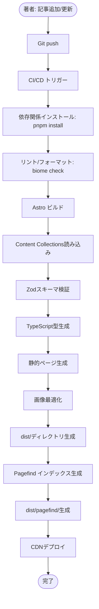

# 技術設計書: Tech Blog

## Overview

本機能は、IT技術に関する情報を発信するための静的ブログサイトを提供します。Astro 5.x + TypeScript + Tailwind CSS v4を基盤とし、Markdownベースのコンテンツ管理、Pagefindによる全文検索、ダークモード対応、高度なコードハイライトを実現します。

**目的**: 技術ブロガー（著者）が記事を効率的に管理・公開し、読者が目的の技術情報に素早くアクセスできる高速なブログプラットフォームを提供する。

**ユーザー**:
- **著者（ブログ管理者）**: Markdown形式で記事を作成・更新し、Gitベースで管理
- **読者（訪問者）**: 記事の閲覧、検索、タグによる絞り込みを実行

**影響**: 完全な新規開発（greenfield）であり、既存システムへの影響はありません。

### Goals

- 完全静的サイトとして高速なページ表示（Lighthouse 95点以上）を実現
- Markdownファイルベースのコンテンツ管理により、著者が技術的負担なく記事を作成可能
- Pagefindによるクライアントサイド全文検索で、読者が記事を効率的に発見
- ダークモード対応とWCAG AA準拠により、多様な環境で快適な閲覧体験を提供
- 将来の外部CMS統合を見据えたRepository Patternによる拡張性確保

### Non-Goals

- リアルタイムコメント機能（外部サービス連携は将来検討）
- 複数著者対応・権限管理（単一著者ブログとして設計）
- サーバーサイドレンダリング（SSR）またはサーバーサイド検索
- 記事の多言語対応（日本語単一言語として設計）

## Architecture

### High-Level Architecture


### Technology Stack and Design Decisions

#### Frontend Layer
- **フレームワーク**: Astro 5.x
  - **選定理由**: ゼロJavaScriptデフォルト、Content Collections API、Islands Architectureによる部分的インタラクティビティ
  - **代替案**: Next.js (SSG), Gatsby - Astroは静的サイトに特化しており、複雑なクライアントサイドフレームワークを避けられる
  - **トレードオフ**: 複雑なSPAには不向きだが、本プロジェクトは静的コンテンツ中心のため最適

- **スタイリング**: Tailwind CSS v4.x
  - **選定理由**: Astro 5.2のネイティブViteプラグイン対応、ユーティリティファースト設計
  - **代替案**: CSS Modules, vanilla CSS - Tailwindは開発速度と一貫性を両立
  - **トレードオフ**: カスタムデザインシステムには制約があるが、本プロジェクトでは問題なし

- **言語**: TypeScript (strict mode)
  - **選定理由**: Content Collections APIの型安全性、コンポーネントPropsの明示的型定義
  - **代替案**: JavaScript - 型安全性とIDEサポートを優先
  - **トレードオフ**: 初期学習コストがあるが、長期的な保守性が向上

#### Content Management Layer
- **コンテンツソース**: Markdown with Frontmatter
  - **選定理由**: Git管理可能、プレーンテキスト、エディタ非依存
  - **代替案**: MDX, 外部CMS - 現時点ではシンプルなMarkdownで十分
  - **トレードオフ**: インタラクティブコンポーネントの埋め込みが制限されるが、将来MDXへの移行可能

- **データ層**: Astro Content Collections
  - **選定理由**: 型安全なスキーマ検証、自動TypeScript型生成、柔軟なクエリAPI
  - **代替案**: 手動ファイル読み込み、外部CMS SDK - Content Collectionsは標準APIで学習コスト低
  - **トレードオフ**: Astroに依存するが、Repository Patternで抽象化

#### Search Layer
- **検索エンジン**: Pagefind
  - **選定理由**: ビルド時インデックス生成、クライアントサイド実行、日本語対応、軽量（~200KB）
  - **代替案**: Algolia, Fuse.js, FlexSearch - Pagefindは静的サイトに最適化され、外部サービス不要
  - **トレードオフ**: リアルタイムインデックス更新不可だが、静的サイトでは問題なし

#### Build & Development Tools
- **パッケージマネージャー**: pnpm v10.x
  - **選定理由**: 高速、ディスク効率的、モノレポ対応
  - **代替案**: npm, yarn - pnpmは依存関係管理が厳格
  - **トレードオフ**: CI/CD環境でpnpmサポートが必要だが、主要サービスは対応済み

- **リンター/フォーマッタ**: Biome
  - **選定理由**: 高速（Rust実装）、ESLint + Prettier統合、設定ファイル最小化
  - **代替案**: ESLint + Prettier - Biomeは単一ツールで管理が容易
  - **トレードオフ**: エコシステムが小さいが、基本機能は十分

### Key Design Decisions

#### Decision 1: Repository Patternによるコンテンツ抽象化

**Context**: 将来的な外部CMS（Contentful, microCMS等）への移行可能性を考慮し、コンテンツ取得ロジックを抽象化する必要がある。

**Alternatives**:
1. Content Collections APIを直接ページコンポーネントで呼び出す
2. GraphQL Layerを導入する
3. Repository Patternでインターフェースを定義する

**Selected Approach**: Repository Pattern

ContentRepositoryインターフェースを定義し、MarkdownRepositoryとして実装。将来的にCMSRepositoryへ切り替え可能な構造とする。

```typescript
interface ContentRepository {
  getAllPosts(): Promise<Post[]>
  getPostBySlug(slug: string): Promise<Post | null>
  getPostsByTag(tag: string): Promise<Post[]>
  getAllTags(): Promise<{ name: string; count: number }[]>
}
```

**Rationale**:
- Astro Content Collections APIへの直接依存を避け、データソース変更時の影響範囲を限定
- ページコンポーネントは抽象インターフェースに依存し、実装詳細を隠蔽
- 環境変数による実装切り替えが可能

**Trade-offs**:
- **利点**: 柔軟性、テスタビリティ向上、関心の分離
- **犠牲**: 抽象化レイヤーによる間接性、小規模プロジェクトには過剰設計の可能性

#### Decision 2: Islands Architectureによる部分的インタラクティビティ

**Context**: テーマ切り替え、検索UI、コードコピー機能など、特定箇所のみインタラクティビティが必要。

**Alternatives**:
1. フルSPA（React/Vueアプリケーション）として構築
2. バニラJavaScriptでグローバルスクリプトを記述
3. Astro Islands Architecture（client:loadディレクティブ）を使用

**Selected Approach**: Astro Islands Architecture

インタラクティブ性が必要な箇所のみ、`client:load`、`client:idle`、`client:visible`ディレクティブで部分的にJavaScriptを読み込む。

**Rationale**:
- 静的コンテンツ（記事本文）はゼロJavaScript、UIコンポーネントのみhydration
- Core Web Vitalsの最適化（FID, LCP）
- 必要最小限のJavaScriptバンドルサイズ

**Trade-offs**:
- **利点**: 高速な初期表示、SEO最適化、低バンドルサイズ
- **犠牲**: フルSPAのようなリッチなインタラクションは制限される（本プロジェクトでは不要）

#### Decision 3: Tailwind CSS v4のViteプラグイン統合

**Context**: Tailwind CSS v4はAstro 5.2でViteプラグインとしてネイティブサポートされ、従来の`@astrojs/tailwind`は非推奨となった。

**Alternatives**:
1. 従来の`@astrojs/tailwind`統合を継続使用
2. 新しい`@tailwindcss/vite`プラグインを使用
3. vanilla CSSまたはCSS Modulesを使用

**Selected Approach**: `@tailwindcss/vite`プラグイン

Astro 5.2の推奨統合方法に従い、Viteプラグインを使用。

**Rationale**:
- 公式推奨の最新アプローチ
- ビルドパフォーマンスの向上
- Tailwind v4の新機能（Oxide Engine）を活用

**Trade-offs**:
- **利点**: 長期的なサポート、最新機能、パフォーマンス
- **犠牲**: 旧統合からの移行が必要（本プロジェクトは新規のため影響なし）

## System Flows

### Article Rendering Flow


### Search Flow


### Content Build Process Flow



## Requirements Traceability

| Requirement | Summary | Components | Interfaces | Flows |
|-------------|---------|------------|------------|-------|
| 1.1-1.6 | コンテンツ表示とナビゲーション | HomePage, PostPage, ArticleList, ArticleCard, Pagination | ContentRepository, Post | Article Rendering Flow |
| 2.1-2.6 | 記事構造化と可読性 | TableOfContents, CodeBlock, MarkdownRenderer | Post.content, HeadingExtractor | Article Rendering Flow |
| 3.1-3.4 | タグ機能 | TagsPage, TagPostsPage, TagList, TagFilter | ContentRepository.getAllTags(), getPostsByTag() | Article Rendering Flow |
| 4.1-4.6 | 全文検索 | SearchPage, PagefindUI | Pagefind JavaScript API | Search Flow |
| 5.1-5.6 | テーマとアクセシビリティ | ThemeToggle, BaseLayout | ThemeProvider | - |
| 6.1-6.4 | レスポンシブデザイン | Header, Navigation, MobileMenu | - | - |
| 7.1-7.3 | Aboutページ | AboutPage | AboutContent (Markdown) | - |
| 8.1-8.8 | SEO最適化 | SEOHead, StructuredData | MetaTags, Schema.org | - |
| 9.1-9.4 | パフォーマンス最適化 | AstroOptimizer, ImageOptimizer | Astro Image Service | Content Build Process |
| 10.1-10.2 | 共通UI | Header, Footer, Navigation | - | - |
| 11.1-11.3 | 試験機能・広告 | ExperimentalPage, AdSlot | - | - |
| 12.1-12.4 | コンテンツ管理 | MarkdownRepository | ContentRepository | Content Build Process |

## Components and Interfaces

### Content Management Domain

#### MarkdownRepository

**Responsibility & Boundaries**
- **Primary Responsibility**: Astro Content CollectionsからMarkdown記事を読み込み、Postエンティティに変換
- **Domain Boundary**: コンテンツデータアクセス層（Infrastructure層）
- **Data Ownership**: ファイルシステム上のMarkdownファイル（`src/content/blog/`）の読み込み
- **Transaction Boundary**: 読み取り専用、ビルド時にのみ実行

**Dependencies**
- **Inbound**: HomePage, PostPage, TagsPage, TagPostsPage（すべてページコンポーネント）
- **Outbound**: Astro Content Collections API (`getCollection`, `getEntry`)
- **External**: なし（ビルド時にファイルシステムから読み込み）

**Contract Definition**

**Service Interface**:
```typescript
interface ContentRepository {
  getAllPosts(): Promise<Post[]>
  getPostBySlug(slug: string): Promise<Post | null>
  getPostsByTag(tag: string): Promise<Post[]>
  getAllTags(): Promise<TagWithCount[]>
}

interface Post {
  slug: string
  title: string
  description: string
  publishedAt: Date
  updatedAt?: Date
  tags: string[]
  content: string
  draft: boolean
}

interface TagWithCount {
  name: string
  count: number
}
```

- **Preconditions**: Content Collectionsが正しく設定され、Markdownファイルがスキーマに準拠
- **Postconditions**: 下書き（`draft: true`）を除外し、`publishedAt`降順でソート済みのPost配列を返す
- **Invariants**: slugは一意、公開記事のみ返す

#### ContentCollectionLoader

**Responsibility & Boundaries**
- **Primary Responsibility**: Astro Content Collections設定（`src/content.config.ts`）を定義し、Zodスキーマでfrontmatter検証
- **Domain Boundary**: コンテンツスキーマ定義層
- **Data Ownership**: frontmatterスキーマ定義
- **Transaction Boundary**: ビルド時の検証フェーズ

**Dependencies**
- **Inbound**: Astro Build Process
- **Outbound**: Zod（スキーマバリデーション）
- **External**: なし

**Contract Definition**

```typescript
// src/content.config.ts
import { defineCollection, z } from 'astro:content'
import { glob } from 'astro/loaders'

const blog = defineCollection({
  loader: glob({ pattern: '**/*.md', base: './src/content/blog' }),
  schema: z.object({
    title: z.string(),
    description: z.string(),
    publishedAt: z.coerce.date(),
    updatedAt: z.coerce.date().optional(),
    tags: z.array(z.string()),
    draft: z.boolean().default(false)
  })
})

export const collections = { blog }
```

- **Preconditions**: Markdownファイルが指定パターンに一致
- **Postconditions**: 型安全なCollectionEntry<'blog'>型が生成される
- **Invariants**: スキーマ違反はビルドエラー

### Page Components Domain

#### HomePage (src/pages/index.astro)

**Responsibility & Boundaries**
- **Primary Responsibility**: 記事一覧を表示し、ページネーション機能を提供
- **Domain Boundary**: プレゼンテーション層
- **Data Ownership**: なし（Repositoryから取得）
- **Transaction Boundary**: なし（静的生成）

**Dependencies**
- **Inbound**: ユーザーリクエスト（CDN経由）
- **Outbound**: ContentRepository, ArticleList, Pagination, BaseLayout
- **External**: なし

**Contract Definition**

**Static Props**:
```typescript
interface HomePageProps {
  posts: Post[]
  currentPage: number
  totalPages: number
  postsPerPage: number // 10
}
```

- **Preconditions**: ContentRepositoryが利用可能
- **Postconditions**: `postsPerPage`件の記事を表示、ページネーションリンクを生成
- **Invariants**: 1ページあたり10件固定

#### PostPage (src/pages/posts/[slug].astro)

**Responsibility & Boundaries**
- **Primary Responsibility**: 個別記事の詳細表示（Markdown本文、メタ情報、目次、コードハイライト）
- **Domain Boundary**: プレゼンテーション層
- **Data Ownership**: なし（Repositoryから取得）
- **Transaction Boundary**: なし（静的生成）

**Dependencies**
- **Inbound**: ユーザーリクエスト（CDN経由）
- **Outbound**: ContentRepository, MarkdownRenderer, TableOfContents, CodeBlock, BaseLayout
- **External**: Shiki（コードハイライト）

**Contract Definition**

**Static Paths**:
```typescript
export async function getStaticPaths() {
  const posts = await contentRepository.getAllPosts()
  return posts.map(post => ({
    params: { slug: post.slug },
    props: { post }
  }))
}

interface PostPageProps {
  post: Post
}
```

- **Preconditions**: slugに対応する記事が存在
- **Postconditions**: Markdown本文をHTMLに変換し、目次とコードハイライトを適用
- **Invariants**: 存在しないslugは404

#### SearchPage (src/pages/search.astro)

**Responsibility & Boundaries**
- **Primary Responsibility**: Pagefind検索UIを提供し、検索結果を表示
- **Domain Boundary**: プレゼンテーション層
- **Data Ownership**: なし（Pagefindインデックスから取得）
- **Transaction Boundary**: なし（クライアントサイド実行）

**Dependencies**
- **Inbound**: ユーザーリクエスト（CDN経由）
- **Outbound**: PagefindUI（client:load）, BaseLayout
- **External**: Pagefind（検索インデックス）

**External Dependencies Investigation**:
Pagefindは静的サイト検索ライブラリで、以下の特徴があります：
- **インデックス生成**: ビルド後に`npx pagefind --site dist`を実行
- **検索実行**: クライアントサイドでJavaScriptを使用し、`/pagefind/pagefind.js`を読み込み
- **日本語対応**: `<html lang="ja">`属性で日本語セグメンテーションを有効化
- **カスタマイズ**: `data-pagefind-body`属性でインデックス範囲を制御、`data-pagefind-ignore`で除外
- **パフォーマンス**: 初回ロード時に~200KBのインデックスをダウンロードし、ブラウザにキャッシュ

**Contract Definition**

```typescript
interface SearchPageProps {
  // Pagefind UIはクライアントサイドで動作
}

// PagefindUI設定
interface PagefindUIOptions {
  element: string // '#search'
  showSubResults: boolean
  showImages: boolean
  excerptLength: number // 100
}
```

- **Preconditions**: Pagefindインデックスが生成済み（`dist/pagefind/`）
- **Postconditions**: 検索キーワードに基づき、タイトル・本文・タグからマッチする記事を表示
- **Invariants**: インデックスが存在しない場合は検索不可

### UI Components Domain

#### ThemeToggle (src/components/ThemeToggle.astro)

**Responsibility & Boundaries**
- **Primary Responsibility**: ライトモード/ダークモードの切り替えとlocalStorageへの保存
- **Domain Boundary**: UI層（インタラクティブコンポーネント）
- **Data Ownership**: テーマ状態（localStorage: 'theme'）
- **Transaction Boundary**: なし（クライアントサイド状態管理）

**Dependencies**
- **Inbound**: Header（すべてのページに表示）
- **Outbound**: localStorage, CSS変数（`data-theme`属性）
- **External**: なし

**Contract Definition**

```typescript
interface ThemeToggleProps {
  // Propsなし（独立したコンポーネント）
}

// クライアントサイドAPI
interface ThemeAPI {
  getCurrentTheme(): 'light' | 'dark'
  setTheme(theme: 'light' | 'dark'): void
  toggleTheme(): void
}
```

- **Preconditions**: `<html>`要素に`data-theme`属性が設定可能
- **Postconditions**: テーマ切り替え時に`data-theme`属性とlocalStorageを更新
- **Invariants**: システム設定を初期値とし、ユーザー選択を優先

**State Management**:
- **State Model**: 'light' | 'dark' | 'system'（システム設定に従う）
- **Persistence**: localStorage (`theme` key)
- **Concurrency**: なし（単一ユーザー操作）

#### CodeBlock (src/components/CodeBlock.astro)

**Responsibility & Boundaries**
- **Primary Responsibility**: コードブロックにShikiシンタックスハイライトを適用し、コピーボタンを提供
- **Domain Boundary**: UI層（部分的にインタラクティブ）
- **Data Ownership**: なし
- **Transaction Boundary**: なし

**Dependencies**
- **Inbound**: MarkdownRenderer（記事本文のコードブロック）
- **Outbound**: Shiki（ビルド時ハイライト）、CopyButton（client:idle）
- **External**: Shiki

**External Dependencies Investigation**:
Shikiは公式VSCodeテーマを使用したシンタックスハイライトライブラリです：
- **統合**: Astroにビルトインサポート（`markdown.shikiConfig`）
- **テーマ**: `github-dark`, `github-light`など多数のテーマ
- **言語**: 200以上のプログラミング言語対応
- **カスタマイズ**: テーマ、行番号表示、行ハイライトをカスタマイズ可能

**Contract Definition**

```typescript
interface CodeBlockProps {
  code: string
  lang: string
  filename?: string
  showLineNumbers?: boolean
}

// astro.config.mjs
markdown: {
  shikiConfig: {
    theme: 'github-dark',
    wrap: true
  }
}
```

- **Preconditions**: コードブロックに言語指定（\`\`\`typescript）
- **Postconditions**: Shikiでハイライト済みHTMLを生成、コピーボタンをhydration
- **Invariants**: 行番号はコピー時に除外

#### TableOfContents (src/components/TableOfContents.astro)

**Responsibility & Boundaries**
- **Primary Responsibility**: 記事のh2/h3見出しから目次を自動生成し、ページ内リンクを提供
- **Domain Boundary**: UI層（静的生成）
- **Data Ownership**: なし
- **Transaction Boundary**: なし

**Dependencies**
- **Inbound**: PostPage
- **Outbound**: HeadingExtractor（remarkプラグイン）
- **External**: remark（Markdownパーサー）

**Contract Definition**

```typescript
interface Heading {
  depth: 2 | 3
  text: string
  slug: string
}

interface TableOfContentsProps {
  headings: Heading[]
}
```

- **Preconditions**: Markdown本文にh2/h3見出しが存在
- **Postconditions**: 見出しテキストからslug生成、階層的な目次を表示
- **Invariants**: h2のみ、またはh2/h3のネスト構造

### Layout Components Domain

#### BaseLayout (src/layouts/BaseLayout.astro)

**Responsibility & Boundaries**
- **Primary Responsibility**: 全ページ共通のHTML構造（head, header, footer）を提供
- **Domain Boundary**: レイアウト層
- **Data Ownership**: サイト全体のメタデータ
- **Transaction Boundary**: なし

**Dependencies**
- **Inbound**: すべてのページコンポーネント
- **Outbound**: Header, Footer, SEOHead
- **External**: なし

**Contract Definition**

```typescript
interface BaseLayoutProps {
  title: string
  description?: string
  image?: string
  type?: 'website' | 'article'
}
```

- **Preconditions**: titleは必須
- **Postconditions**: SEOメタタグ、Open Graph、Twitter Cardを含むHTML生成
- **Invariants**: すべてのページで一貫したhead/header/footer構造

## Data Models

### Domain Model

#### Post（記事エンティティ）

**Entity Definition**:
```typescript
interface Post {
  slug: string              // 一意識別子（URLパス）
  title: string             // 記事タイトル
  description: string       // 概要（150文字推奨）
  publishedAt: Date         // 公開日時
  updatedAt?: Date          // 更新日時（任意）
  tags: string[]            // タグ配列
  content: string           // Markdown本文
  draft: boolean            // 下書きフラグ
}
```

**Business Rules & Invariants**:
- `slug`は一意（ファイル名から自動生成、重複時はビルドエラー）
- `draft: true`の記事は公開されない（`getAllPosts()`で除外）
- `tags`は最低1つ必須、表示時は最大3つまで
- `publishedAt`は過去日時（未来日時の記事は非公開として扱う可能性、現時点では未実装）
- `content`はMarkdown形式（HTML不可）

**Aggregates**:
- Postは単独のAggregate Root（他のエンティティとの関連なし）
- Tag統計（TagWithCount）はPostから派生するValue Object

**Domain Events**:
- 新規記事公開（PostPublished）: Gitプッシュ時にCI/CDトリガー
- 記事更新（PostUpdated）: `updatedAt`フィールド更新

### Physical Data Model

#### Markdownファイル構造

**File Naming Convention**:
```
src/content/blog/YYYY-MM-DD-slug.md
```
例: `src/content/blog/2025-01-15-astro-blog-tutorial.md`

**Frontmatter Schema** (Zod):
```typescript
const blogSchema = z.object({
  title: z.string().min(1).max(200),
  description: z.string().min(1).max(300),
  publishedAt: z.coerce.date(),
  updatedAt: z.coerce.date().optional(),
  tags: z.array(z.string()).min(1).max(10),
  draft: z.boolean().default(false)
})
```

**Example Markdown File**:
```markdown
---
title: "Astro 5でブログを構築する"
description: "Astro 5.xとTailwind CSS v4を使った技術ブログの構築手順を解説"
publishedAt: 2025-01-15
updatedAt: 2025-01-20
tags: ["Astro", "TypeScript", "Tailwind CSS"]
draft: false
---

# 記事本文

本文の内容...

## セクション1

詳細な説明...

```typescript:filename.ts
// コード例
const example = 'Hello, Astro!'
```
```

**Storage Strategy**:
- **Format**: UTF-8エンコードMarkdown
- **Consistency Model**: ファイルシステムベース（Gitによるバージョン管理）
- **Backup**: Gitリポジトリ全体がバックアップ

#### Pagefind Index Structure

**Generated Files**:
```
dist/pagefind/
├── pagefind.js           # 検索API
├── pagefind-ui.js        # デフォルトUI
├── pagefind-ui.css       # UIスタイル
└── index/                # 検索インデックス（バイナリ）
```

**Index Content**:
- 記事タイトル、本文、タグをトークン化
- 日本語セグメンテーション（MeCabベース）
- メタデータ（URL、公開日、タグ）

**Indexing Strategy**:
- ビルド時に`npx pagefind --site dist`で生成
- `data-pagefind-body`属性で`<article>`タグ内のみをインデックス化
- Header/Footerは`data-pagefind-ignore`で除外

### Data Contracts & Integration

#### Repository Interface Contract

```typescript
// src/lib/repositories/content-repository.ts
export interface ContentRepository {
  getAllPosts(): Promise<Post[]>
  getPostBySlug(slug: string): Promise<Post | null>
  getPostsByTag(tag: string): Promise<Post[]>
  getAllTags(): Promise<TagWithCount[]>
}

// 環境変数による実装切り替え（将来的にCMS対応）
export const contentRepository: ContentRepository =
  import.meta.env.USE_CMS === 'true'
    ? new CMSRepository()   // 未実装
    : new MarkdownRepository()
```

#### SEO Schema Contract

**BlogPosting Schema** (記事ページ):
```json
{
  "@context": "https://schema.org",
  "@type": "BlogPosting",
  "headline": "記事タイトル",
  "description": "記事の概要",
  "datePublished": "2025-01-15T00:00:00Z",
  "dateModified": "2025-01-20T00:00:00Z",
  "author": {
    "@type": "Person",
    "name": "著者名"
  },
  "publisher": {
    "@type": "Organization",
    "name": "ブログ名",
    "logo": {
      "@type": "ImageObject",
      "url": "https://example.com/logo.png"
    }
  }
}
```

**Blog Schema** (ホームページ):
```json
{
  "@context": "https://schema.org",
  "@type": "Blog",
  "name": "ブログ名",
  "description": "ブログの説明"
}
```

## Error Handling

### Error Strategy

静的サイトのため、実行時エラーは最小限。エラーハンドリングはビルド時とクライアントサイドに分離。

**ビルド時エラー**:
- Content Collectionsスキーマ違反 → ビルド失敗、詳細エラーメッセージ表示
- 画像最適化エラー → 警告ログ、元画像を使用

**クライアントサイドエラー**:
- Pagefindインデックスロード失敗 → 検索不可メッセージ表示
- テーマ切り替え失敗 → システムデフォルトを維持

### Error Categories and Responses

**User Errors (4xx)**:
- **404 Not Found**: 存在しないslugへのアクセス → カスタム404ページ、ホームへの導線
- **400 Bad Request**: 不正な検索クエリ（実装レベルでは発生しない）

**System Errors (5xx)**:
- **CDN障害**: 静的ファイル配信不可 → CDNプロバイダーのフォールバック機構に依存
- **ビルド失敗**: CI/CDパイプライン停止 → 前回の成功ビルドを維持、通知送信

**Business Logic Errors (422)**:
- **スキーマ違反**: frontmatterが不正 → ビルドエラー、該当ファイルと行番号を表示
- **重複slug**: 同一slugのファイルが複数存在 → ビルドエラー、衝突ファイル名を表示

### Monitoring

**ビルド時監視**:
- CI/CDログでビルドステータスを確認
- スキーマエラー、リンター警告、画像最適化状況をログ出力

**実行時監視**:
- Lighthouse CIで継続的にパフォーマンス計測（Vercel Analytics等）
- エラートラッキングは不要（静的サイトのため実行時エラー最小）

## Testing Strategy

### Unit Tests

1. **ContentRepository.getAllPosts()**:
   - 下書き記事を除外することを検証
   - `publishedAt`降順ソートを検証
   - 空配列の場合の動作を検証

2. **ContentRepository.getPostBySlug()**:
   - 存在するslugでPost取得を検証
   - 存在しないslugでnull返却を検証

3. **ContentRepository.getPostsByTag()**:
   - 指定タグを含む記事のみ返却を検証
   - 存在しないタグで空配列を返却を検証

4. **ThemeToggle.toggleTheme()**:
   - テーマ切り替え時にlocalStorage更新を検証
   - `data-theme`属性更新を検証

5. **HeadingExtractor**:
   - Markdown本文からh2/h3見出しを抽出し、slugを生成することを検証

### Integration Tests

1. **HomePage ページネーション**:
   - 記事数が10件超の場合、ページネーションリンクが生成されることを検証
   - 各ページに正しい記事が表示されることを検証

2. **PostPage 記事表示**:
   - slugに基づき正しい記事を表示することを検証
   - Markdown本文がHTMLに変換されることを検証
   - 目次が生成されることを検証

3. **SearchPage Pagefind統合**:
   - 検索キーワードでマッチする記事が返却されることを検証
   - スニペットにハイライトが適用されることを検証

4. **TagsPage タグ統計**:
   - すべてのタグと投稿数が表示されることを検証
   - タグクリックで該当記事一覧へ遷移することを検証

5. **ビルドプロセス**:
   - `pnpm build`でdist/ディレクトリが生成されることを検証
   - Pagefindインデックスが`dist/pagefind/`に生成されることを検証

### E2E/UI Tests

1. **記事閲覧フロー**:
   - ホームページ → 記事クリック → 記事詳細表示を検証
   - 目次リンクでページ内スクロールを検証

2. **検索フロー**:
   - 検索ページでキーワード入力 → 結果表示を検証
   - 結果クリックで記事詳細へ遷移を検証

3. **タグフィルタリングフロー**:
   - タグ一覧ページ → タグクリック → 該当記事一覧表示を検証

4. **テーマ切り替えフロー**:
   - テーマトグルボタンクリック → CSS変数変更を検証
   - ページリロード後もテーマが維持されることを検証

5. **モバイルナビゲーション**:
   - 画面幅640px未満でハンバーガーメニュー表示を検証
   - メニュー開閉動作を検証

### Performance/Load Tests

1. **Lighthouse Score**:
   - ホームページ、記事ページでPerformance 95点以上を検証

2. **Core Web Vitals**:
   - LCP 2.5秒以内、FID 100ms以内、CLS 0.1以下を検証

3. **バンドルサイズ**:
   - 初期ロードで100KB以内（gzip圧縮後）を検証

4. **ビルド時間**:
   - 100記事で1分以内のビルド完了を検証

## Security Considerations

### 脅威モデリング

**攻撃ベクトル**:
1. **XSS（Cross-Site Scripting）**: Markdown本文にスクリプトタグを挿入
   - **対策**: AstroのMarkdownレンダラーがデフォルトでHTMLエスケープ、`set:html`は使用しない
2. **CSRF（Cross-Site Request Forgery）**: 静的サイトのため対象外
3. **情報漏洩**: 下書き記事の意図しない公開
   - **対策**: `draft: true`の記事をビルド時に除外、リポジトリアクセス制御

### セキュリティコントロール

**コンテンツセキュリティポリシー（CSP）**:
```html
<meta http-equiv="Content-Security-Policy"
      content="default-src 'self'; script-src 'self' 'unsafe-inline'; style-src 'self' 'unsafe-inline'">
```
- `'unsafe-inline'`はPagefind UIとテーマ切り替えに必要（将来的にnonceベースに移行検討）

**依存関係スキャン**:
- Dependabotで脆弱性自動検出
- 定期的な`pnpm audit`実行

### データ保護とプライバシー

**個人情報の取り扱い**:
- 読者の個人情報は収集しない（静的サイトのため）
- GoogleアナリティクスやCookieバナーは将来検討

**データの暗号化**:
- HTTPS必須（CDN/ホスティングプロバイダーのTLS証明書）

## Performance & Scalability

### Target Metrics

| Metric | Target | Measurement Strategy |
|--------|--------|----------------------|
| Lighthouse Performance | 95+ | Vercel Analytics、CI/CD統合 |
| LCP | < 2.5s | Chrome DevTools、WebPageTest |
| FID | < 100ms | Real User Monitoring（RUM） |
| CLS | < 0.1 | Lighthouse、PageSpeed Insights |
| バンドルサイズ（初期ロード） | < 100KB (gzip) | Bundle Analyzer |
| ビルド時間（100記事） | < 1分 | CI/CDパイプライン計測 |

### Scaling Approaches

**水平スケーリング**:
- CDNエッジキャッシュで世界中の読者に高速配信
- 記事数増加（1000+件）でもビルド時間を維持するため、インクリメンタルビルド検討（Astro 5のContent Layer活用）

**垂直スケーリング**:
- 不要（静的ファイル配信のみ）

### Caching Strategies

**CDNキャッシュ**:
- HTML: `Cache-Control: public, max-age=3600, s-maxage=86400`（1時間クライアント、24時間CDN）
- 静的アセット（CSS/JS/画像）: `Cache-Control: public, max-age=31536000, immutable`（1年間）

**ブラウザキャッシュ**:
- Pagefindインデックス: localStorageに保存（2回目以降の検索が即座に実行）
- テーマ設定: localStorage (`theme` key)

**ビルドキャッシュ**:
- CI/CDで依存関係とAstroビルドキャッシュを保存（pnpmキャッシュ、Astro `.astro/`）
